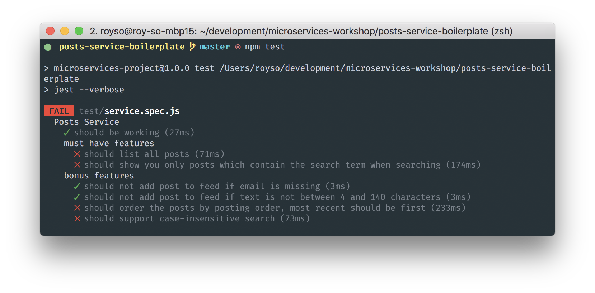

# Introduction to Microservices
The Images Service

## General Info
We are going to build a service that's in charge of managing the gifs gallery in our system.

The service is basically a nodejs express server. Everything you need to run it is already there - all that's left is to implement the logic and make sure that it's working correctly! Easy.

If you don't remember certain things about express, you can use the [documentation](https://expressjs.com/en/4x/api.html).

## Getting Started
Assuming you have nodejs and npm installed, let's get the code. You can use one of two methods:

1. If you have git installed, just clone this repository and then run: `$ git checkout images-service`.
2. Otherwise, click [here](https://github.com/illBeRoy/microservices-workshop-public/archive/images-service.zip) to download the code.

Now, open the code's directory in the terminal and run: `$ npm install`. This will install everything that's needed to run your code.

Finally, run `$ npm run watch`. This will start a babel compiler instance which will **automatically** compile your code, every time you change it. Make sure you don't turn this off or your code will stop compiling.

## Testing
We use tests to determine whether or not our server is ready. The tests are divided into two sections:

1. **Must Have Features**: you have to pass those tests by the end of the workshop.
2. **Bonus Features**: these are features which are nice to have, so if you have time left - do them!

Every time you want to check your code, run the tests using `$ npm test`.

Initially, only one test should pass (sanity test), and the terminal would look like this:

## Running the Server
If you want to check your server locally, you can run it using `$ npm start`. It will bring it up on port `3002` so you can visit it and check it for yourself.

## The Expected API
| Route | Method | Expected Input|Return Value|
|-------|--------|---------------|------------|
| `/trending` | `GET` | Nothing | `[{ "preview": "URL of preview (small) gif", "original": "URL of original (big) gif"}]` array of gifs
| `/search` | `GET` | `/search?query=SOME_TEXT` | `[{ "preview": "URL of preview (small) gif", "original": "URL of original (big) gif"}]` array of gifs that match criteria

That said, the `/search` endpoint is optional! Make sure to get the `/trending` endpoint done first, and only implement `/search` if you have time for that!

## The GIPHY API
In order to integrate with giphy, we need an api key that giphy generates for us. Luckily, we use a custom `fetch` client which already contains such API key, so you don't have to worry about it. If you're unfimiliary with how fetch works, read about it [here](https://developer.mozilla.org/en-US/docs/Web/API/WindowOrWorkerGlobalScope/fetch).

The `/trending` api uses giphy's `/v1/gifs/trending` endpoint. The `/search` api uses giphy's `/v1/gifs/search` endpoint. Read about them [here](https://developers.giphy.com/docs/), and look for how you get the `original.url` and `preview.url` values from the response. If you need help - I'm here for you!

**Good Luck!**