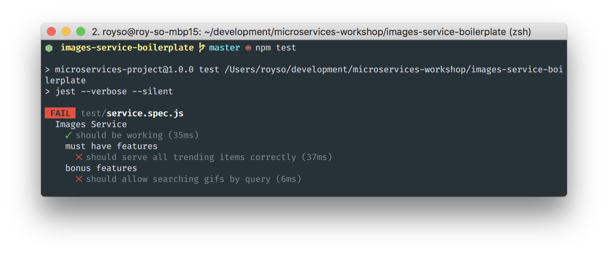

# Introduction to Microservices
The Posts Service

## General Info
We are going to build a service that's in charge of managing the posts in our system.

The service is basically a nodejs express server. Everything you need to run it is already there - all that's left is to implement the logic and make sure that it's working correctly! Easy.

If you don't remember certain things about express, you can use the [documentation](https://expressjs.com/en/4x/api.html).

## Getting Started
Assuming you have nodejs and npm installed, let's get the code. You can use one of two methods:

1. If you have git installed, just clone this repository and then run: `$ git checkout posts-service`.
2. Otherwise, click [here](https://github.com/illBeRoy/microservices-workshop-public/archive/posts-service.zip) to download the code.

Now, open the code's directory in the terminal and run: `$ npm install`. This will install everything that's needed to run your code.

Finally, run `$ npm run watch`. This will start a babel compiler instance which will **automatically** compile your code, every time you change it. Make sure you don't turn this off or your code will stop compiling.

## Testing
We use tests to determine whether or not our server is ready. The tests are divided into two sections:

1. **Must Have Features**: you have to pass those tests by the end of the workshop.
2. **Bonus Features**: these are features which are nice to have, so if you have time left - do them!

Every time you want to check your code, run the tests using `$ npm test`.

Initially, only one test should pass (sanity test). That said, some tests might pass because they check for negative result (which is the default state of our server). The terminal would look like this:


## Running the Server
If you want to check your server locally, you can run it using `$ npm start`. It will bring it up on port `3001` so you can visit it and check it for yourself.

## The Expected API
| Route | Method | Expected Input|Return Value|
|-------|--------|---------------|------------|
| `/post` | `POST` | ```{ "email": "Email of the author", "text": "Content of the post", "image": "URL of image. OPTIONAL"}``` | Nothing
| `/feed` | `GET` | `/feed` | `[{ email, text, image } ...]` array of existing posts
| `/search` | `GET` | `/search?term=SOME_TEXT` | `[{ email, text, image } ...]` array of posts which contain the text

## The Database
In this project, you will use a simple "database". It saves data in the ram, and so if you shut down your server it will reset all your data. Read the database's code for more information (or ask me!)

**Good Luck!**